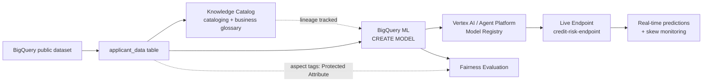

# AI Governance for a Credit Risk Model on GCP

An end-to-end example of applying data governance principles to an AI/ML system — extending existing data cataloging, lineage, and stewardship skills into AI governance, using tools built directly into Google Cloud.

**Why this project:** credit risk scoring is classified as a **high-risk AI system under the EU AI Act (Annex III)**, meaning it requires real governance — documentation, fairness auditing, human oversight, and monitoring — not just a working model. This project builds and documents each of those controls for a real (if small-scale) credit default prediction model.

## Architecture

## Screenshots

**Cataloged table with business glossary and fairness tags:**

**Model Registry showing versioned iterations:**

**Fairness evaluation — recall by group:**

**Live prediction — real-time inference test:**

## What's in this repo
| File | Contents |
|---|---|
| [`model-card.md`](./model-card.md) | Full model documentation — purpose, performance, known limitations, fairness findings, live validation results |
| [`access-control.md`](./access-control.md) | IAM least-privilege review, including a real finding about additive permissions |

## Key findings

**1. Accuracy hides more than it reveals.** The model scores 80.6% accuracy but only **23% recall** — meaning it misses roughly 3 out of 4 people who actually default. Full details in the model card.

**2. A real fairness disparity, found and quantified.** Group-wise evaluation by `sex` showed recall of 0.271 (male) vs 0.193 (female) — a ratio of 0.71, below the conventional four-fifths threshold used in disparate-impact analysis. Notably, accuracy and precision were both *higher* for the group with worse recall, which would have hidden this finding if accuracy were the only metric reviewed.

**3. Confirmed live, not just in batch.** The model was deployed to a real endpoint and tested against two known defaulters — both were missed in live serving, consistent with the documented recall limitation.

**4. A real IAM lesson.** Attempting to apply a least-privilege Viewer role revealed that Google Cloud IAM permissions are additive — an account with inherited Owner access isn't restricted by also holding a Viewer role. Documented in `access-control.md` as a genuine governance review finding, not glossed over.

**5. A data quality catch during cataloging.** `pay_5` and `pay_6` were typed as STRING while the rest of the `pay_*` series was FLOAT — caught during schema review and corrected with `SAFE_CAST` before retraining (v2/v3).

## Governance mapped to the NIST AI Risk Management Framework

| NIST Function | What satisfies it in this project |
|---|---|
| **Govern** | Model ownership assigned; IAM least-privilege review (with documented finding); Aspect Type formally flagging fields requiring fairness monitoring |
| **Map** | Model Card purpose/intended-use documentation; EU AI Act risk classification (High-Risk); business glossary linking governance terms to real columns |
| **Measure** | Full evaluation metrics; group-wise fairness slicing with a quantified disparity ratio; live endpoint validation against real cases |
| **Manage** | Training-serving skew monitoring configured; explicit "not recommended for production as-is" decision; human-in-the-loop requirement documented |

**Scope note, stated honestly:** fairness was tested for `sex` only, not yet for `age`, `education_level`, or `marital_status`, though all four were tagged as Protected Attributes during cataloging. Inference drift detection was configured conceptually but not exercised, since the endpoint was only live briefly for testing. These are noted as explicit next steps, not silent gaps.

## Tech stack
BigQuery · BigQuery ML · Dataplex / Knowledge Catalog · Vertex AI Model Registry (Gemini Enterprise Agent Platform) · Vertex AI Online Prediction · Model Monitoring

## Dataset
[`bigquery-public-data.ml_datasets.credit_card_default`](https://cloud.google.com/bigquery/public-data) — the Taiwan Credit Card Default dataset, publicly available in BigQuery.

## Background
Built as a hands-on extension of enterprise data governance work (Center of Excellence accelerator building, GCP Dataplex, data quality and stewardship frameworks) into the AI governance space — applying the same cataloging, lineage, and IAM principles to an ML model instead of a data pipeline.
